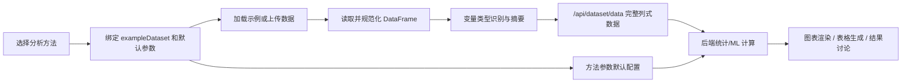

# 临床高级统计与机器学习一键化分析平台

**Clinical Advanced Statistics & Machine Learning One-Click Platform**

面向临床科研数据的高级统计建模与机器学习全流程分析平台。提供 13 类高级统计方法、8 种机器学习模型和 4 项综合分析工具，每种方法均配备对应示例数据、自动参数配置和一键化全流程分析。

## 核心特性

- **方法优先工作流**：先在左侧方法目录中选择分析方法，再加载示例数据或上传自己的数据——方法决定变量槽位和默认参数。
- **示例数据一一对应**：25 种方法各配备对应示例数据集，选择方法后自动绑定，开箱即用。
- **一键化全流程**：选择方法 → 加载示例 → 运行分析 → 自动输出数据概览、模型结果、可视化图表和诊断评估。
- **CNS 出版级图形**：11 种图表主题（CNS/CHARLS/Nature/Lancet/NEJM/Science 等），支持 Plotly 交互图和 matplotlib 出版级导出。
- **深度结果讨论**：每个方法自动生成基于实际分析结果的临床讨论和统计推断文本。
- **三线表一键生成**：基线资料表（自动 P 值计算）、描述统计表、缺失值统计表，支持多变量选择。
- **多格式导出**：图表支持 PNG / SVG / PDF / TIFF，表格支持 CSV / Excel / HTML 导出。

## 功能概览

- **多格式数据上传**：CSV / TSV / TXT / XLSX / XLS / XLSM
- **智能变量识别**：连续变量、分类变量、二分类变量、日期变量、ID 变量、分组变量、结局候选变量
- **13 类高级统计方法**：GEE、倾向性评分匹配、敏感性分析、反事实推断、复杂生存分析、马尔可夫模型、贝叶斯统计、拉丁方方差分析、荟萃分析、中介效应、混合效应模型、复杂抽样分析、LDSC 遗传共病分析
- **8 种机器学习模型**：逻辑回归、Lasso/岭回归、KNN、XGBoost、随机森林、SVM、决策树、1D-CNN
- **4 项综合工具**：特征工程、模型比较、降维分析、聚类分析
- **25 个示例数据集**：覆盖纵向临床数据、观察性研究、生存数据、组学数据、遗传数据等场景
- **三线表一键生成**：基线资料表、描述统计表、缺失值统计表，支持自动 P 值计算
- **多主题图表**：CNS 出版、CHARLS 临床、Nature、Lancet、NEJM、Science、暖色调、冷色调、柔和马卡龙、深色低调、单色灰阶
- **多格式导出**：PNG / SVG / PDF / CSV / Excel / HTML

## 快速开始

### 环境要求

- Python 3.10+
- pip

### 安装

```bash
cd MLhigh
python -m venv venv

# Windows
venv\Scripts\activate

# Linux / macOS
source venv/bin/activate

pip install -r requirements.txt
```

### 启动

```bash
python run.py
```

默认访问地址：

```text
http://127.0.0.1:8868
```

如果 8868 端口已有旧服务占用，可以临时换端口启动：

```bash
python -m uvicorn app.main:app --host 127.0.0.1 --port 8872
```

## 推荐使用流程

1. 在左侧"方法目录"中先选择想使用的分析方法。
2. 点击"加载示例"快速查看本方法效果，或下载对应示例 CSV 后按模板整理数据。
3. 上传自己的 CSV/Excel，平台会重新识别变量类型并保留在当前方法工作台。
4. 确认参数配置，点击"运行分析"。
5. 在结果面板查看数据概览、模型结果、可视化和诊断评估。
6. 导出图表（PNG/SVG/CSV）或表格（Excel/HTML）。

## 核心数据流



## 方法与示例数据映射

### 高级统计方法

| 方法 | ID | 示例数据 |
|---|---|---|
| 广义估计方程 (GEE) | `gee` | `gee_example` |
| 倾向性评分匹配 (PSM) | `propensity_score` | `propensity_score_example` |
| 稳健性与敏感性分析 | `sensitivity_analysis` | `sensitivity_analysis_example` |
| 反事实推断与因果推断 | `counterfactual` | `counterfactual_example` |
| 复杂生存与疾病进程建模 | `survival_advanced` | `survival_advanced_example` |
| 马尔可夫模型 | `markov_model` | `markov_model_example` |
| 贝叶斯统计分析 | `bayesian` | `bayesian_example` |
| 拉丁方裂项方差分析 | `latin_square` | `latin_square_example` |
| 荟萃分析 | `meta_analysis` | `meta_analysis_example` |
| 中介效应分析 | `mediation` | `mediation_example` |
| 混合效应模型 | `mixed_effects` | `mixed_effects_example` |
| 复杂抽样分析 | `nhanes_analysis` | `nhanes_analysis_example` |
| LDSC 共病分析 | `ldsc` | `ldsc_example` |

### 机器学习模型

| 方法 | ID | 示例数据 |
|---|---|---|
| 逻辑回归 | `ml_lr` | `ml_lr_example` |
| Lasso/岭回归 | `ml_lasso` | `ml_lasso_example` |
| K近邻 (KNN) | `ml_knn` | `ml_knn_example` |
| XGBoost | `ml_xgboost` | `ml_xgboost_example` |
| 随机森林 | `ml_rf` | `ml_rf_example` |
| 支持向量机 | `ml_svm` | `ml_svm_example` |
| 决策树 | `ml_dt` | `ml_dt_example` |
| 卷积神经网络 (1D-CNN) | `ml_cnn` | `ml_cnn_example` |

### 综合工具

| 方法 | ID | 示例数据 |
|---|---|---|
| 特征工程 | `feature_engineering` | `feature_engineering_example` |
| 模型比较 | `model_comparison` | `model_comparison_example` |
| 降维分析 | `dim_reduction` | `dim_reduction_example` |
| 聚类分析 | `cluster` | `cluster_example` |

> **说明**：除 LDSC 示例使用手工构造的真实格式数据外，其余 24 个示例数据集均由 `app/services/sample_service.py` 中的生成器函数在首次启动时自动生成，确保每个方法都有可直接运行的演示数据。

## 项目结构

```text
MLhigh/
├── README.md
├── LICENSE
├── requirements.txt
├── pyproject.toml
├── run.py
├── app/
│   ├── main.py                  # FastAPI 路由和应用入口
│   ├── config.py                # 路径和运行目录配置
│   ├── schemas.py               # Pydantic 请求模型
│   ├── services/
│   │   ├── io_service.py        # 上传、示例、编码/分隔符识别、数据读取
│   │   ├── variable_service.py  # 变量类型识别和数据摘要
│   │   ├── sample_service.py    # 示例数据生成函数（24个生成器）
│   │   ├── stats_service.py     # 高级统计方法核心实现（13种）
│   │   ├── ml_service.py        # 机器学习模型核心实现（8+4种）
│   │   ├── chart_service.py     # 图表生成服务（Plotly + matplotlib）
│   │   ├── table_service.py     # 三线表数据生成
│   │   ├── report_service.py    # 结果讨论/报告生成
│   │   └── export_service.py    # 表格和配置导出
│   └── static/
│       ├── index.html
│       ├── styles.css            # 主样式文件
│       ├── vendor/
│       │   └── plotly.min.js    # 本地捆绑 Plotly.js
│       ├── css/                  # 模块化 CSS（主题/布局/组件/表格）
│       │   ├── theme.css
│       │   ├── layout.css
│       │   ├── components.css
│       │   └── tables.css
│       └── js/
│           ├── utils.js          # 全局状态管理和工具函数
│           ├── methodConfigs.js  # 方法目录定义
│           ├── app.js            # 主应用逻辑
│           ├── upload.js         # 文件上传
│           ├── dataPreview.js    # 数据预览渲染
│           ├── variableSelect.js # 变量选择槽位
│           ├── charts.js         # 图表渲染
│           ├── chartThemes.js    # 11种出版级图表主题
│           ├── tableGenerator.js # 三线表生成
│           └── download.js       # 图表和数据导出
├── data/
│   ├── examples/                # 25个示例数据集（CSV）
│   └── uploads/                 # 用户上传文件
├── outputs/                     # 分析导出输出
├── docs/
│   ├── INTEGRATION.md           # 二次集成说明
│   └── EXTENSION.md             # 后续扩展说明
└── tests/
    └── smoke.py                 # 核心服务冒烟测试
```

## API 概览

| 端点 | 方法 | 说明 |
|---|---|---|
| `/api/health` | GET | 健康检查 |
| `/api/upload` | POST | 上传数据文件并返回预览、变量识别和摘要 |
| `/api/read-sheet` | POST | 读取 Excel 指定工作表 |
| `/api/examples` | GET | 列出示例数据集 |
| `/api/examples/{name}` | GET | 获取示例数据预览和变量识别 |
| `/api/examples/{name}/download` | GET | 下载单个示例 CSV |
| `/api/dataset/data` | POST | 返回完整列式数据 |
| `/api/methods` | GET | 获取方法目录 |
| `/api/analyze` | POST | 一键运行分析方法 |
| `/api/table/baseline` | POST | 生成基线资料表 |
| `/api/table/descriptive` | POST | 生成描述统计表 |
| `/api/table/missing` | POST | 生成缺失值统计表 |
| `/api/export/table-csv` | POST | 导出表格 CSV |
| `/api/export/table-excel` | POST | 导出表格 Excel |
| `/api/export/table-html` | POST | 导出表格 HTML |
| `/api/export/chart/publication` | POST | 导出出版级图表 PNG / SVG / PDF |

## 开发与验证

```bash
python tests\smoke.py
python -m compileall app
node --check app\static\js\methodConfigs.js
node --check app\static\js\charts.js
node --check app\static\js\upload.js
node --check app\static\js\tableGenerator.js
```

## 集成与扩展

- 二次集成说明：[docs/INTEGRATION.md](docs/INTEGRATION.md)
- 添加新方法、新示例、新主题：[docs/EXTENSION.md](docs/EXTENSION.md)

## 许可证

MIT License
